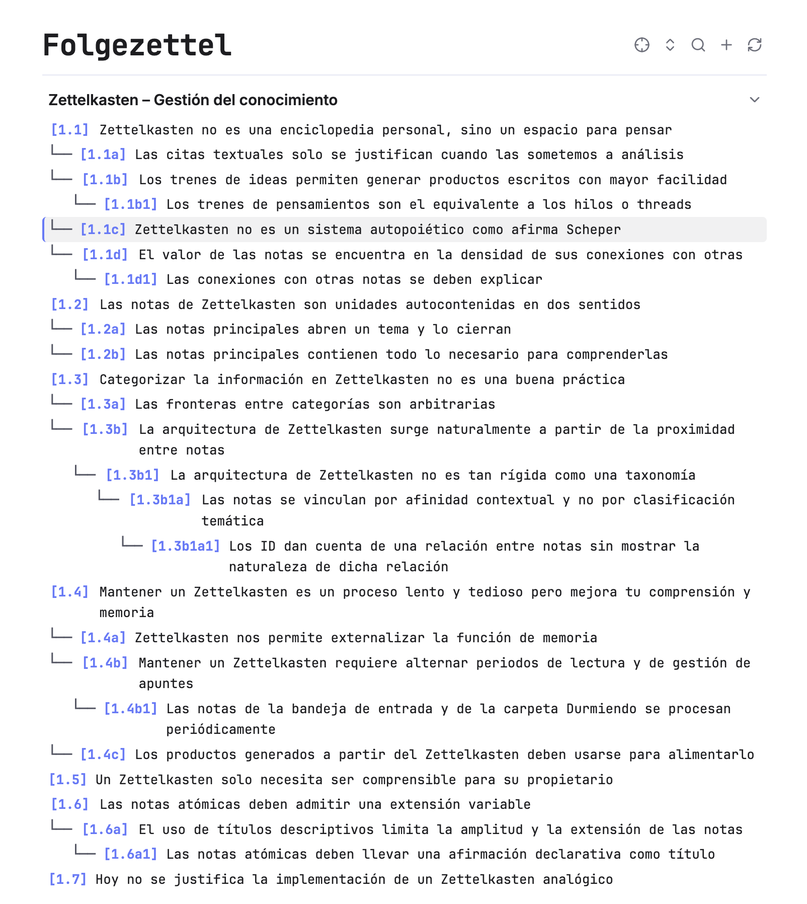

# Folgezettel for Obsidian

A dedicated, native outline view and branching toolkit for Luhmann-style **Folgezettel** note systems in Obsidian.



Folgezettel scans Markdown notes located at your vault's root that begin with an alphanumeric identifier (e.g., `1.1`, `1.1a`, `1.1a1`, `1.2`, etc.) and visualizes them as an indented, branching thought-train tree with clean tree guides, foldable threads, real-time filtering, and one-click branching actions.

---

## Features

### 🌳 Visual Folgezettel Hierarchy
- **Monospace Tree Alignment**: Uses ASCII guide connectors (`└── `) that visually align directly with note IDs.
- **Root-based Thought Trains**: Discovers notes at the root of your vault adhering to Folgezettel notation and organizes them into sequential top-level threads (`1.x`, `2.x`, `3.x`, etc.).
- **Foldable Nodes**: Click directly on any `[ID]` badge to fold or expand its child branches.
- **Native Layout**: Renders with readable line length matching Obsidian's Live Preview and Reading views. Opens in a full tab or right sidebar.

### 🏷️ Click-to-Edit Thread Headers
- **Thematic Thread Labels**: Name each major thread with a descriptive topic (e.g., *Zettelkasten – Knowledge Management*).
- **Click-to-Edit UX**: Displays seamlessly as a clean section heading. Click the heading to toggle into an inline editor, change or clear the label, and press `Enter` or click outside to save.
- **Thread Folding Chevron**: Each thread header features a dedicated `v` chevron on the far right to collapse or expand the entire thread.
- **Automatic Persistence**: All thread labels are stored safely in `.obsidian/plugins/folgezettel/data.json`.

### 🔍 Live Search & Filtering
- **Ancestor-Preserving Search**: Filter notes in real time by ID, title, or thread label.
- **Context Retention**: When a note matches your query, its ancestral path remains visible so you never lose context within the hierarchy.
- **Underlined Match Indicators**: Matches are clearly highlighted while preserving the clean look of the outline.

### 🌿 Contextual Branching & Note Assignment
- **Context Menu Actions**: Right-click any note in the outline to access context-aware actions:
  - **Assign note to branch (`[ID]`)**: Select an unassigned note from your `Bandeja de entrada` (Inbox) or `Durmiendo` (Incubation) folders via fuzzy search and automatically move and rename it into the calculated branch slot.
  - **Create note in branch (`[ID]`)**: Instantly create a new note with the calculated branch ID and open it in a new tab.
  - **Continue thread (`[ID]`)**: If available on the main backbone thread (e.g., `1.1` → `1.2`), assign or create the next consecutive sibling note.
- **Command Palette Integration**: The exact same branching actions dynamically appear in Obsidian's Command Palette (`Cmd + P`) whenever you have a Folgezettel note open.
- **New Thread Button**: A toolbar button and palette command calculate the next available major thread (e.g., `13.1`) with a single click.

### 🔗 Reference Insertion with ID Alias
- **Editor Command**: Trigger `Folgezettel: Insert reference` (`Insertar referencia`) from the Command Palette while writing any note.
- **Fuzzy Search by ID or Title**: Find any Folgezettel note quickly.
- **Automatic Wikilink Alias**: Automatically inserts `[[Full Note Title|ID]]` (e.g., `[[4.4c Memory retrieval|4.4c]]`) at your cursor.

### 🎯 Active Note Sync & Navigation
- **Smooth Auto-Scroll**: Highlights and centers the currently active note in the tree as you navigate your vault.
- **Locate Active Note Toolbar Icon**: Unfolds any collapsed ancestors or threads and centers the active note instantly.

### 🌐 Bilingual Support (English & Spanish)
- **Automatic Language Detection**: Follows Obsidian's active interface language and adapts all buttons, tooltips, placeholders, modals, notices, and commands automatically.
- **Manual Language Setting**: Choose between **Automatic**, **Español**, or **English** in the plugin settings (**Settings > Folgezettel**).
- **Flexible Folder Discovery**: Supports both English (`Inbox`, `Incubation`, `Sleeping`) and Spanish (`Bandeja de entrada`, `Durmiendo`) folders when assigning new notes to branches.

---

## Numbering Convention

Folgezettel implements Niklas Luhmann's branching convention:

| Sequence | Type | Example |
| :--- | :--- | :--- |
| **Major Thread** | Root conceptual cluster | `1.1`, `2.1`, `3.1` |
| **Sibling on Backbone** | Continuation of top-level train | `1.1` → `1.2` → `1.3` |
| **Branch / Digression** | Alternating digits and letters | `1.1` → `1.1a` → `1.1a1` → `1.1a1a` |

---

## Commands

| Command | Description |
| :--- | :--- |
| `Folgezettel: Open outline in a new tab` | Opens the Folgezettel view in a central workspace tab. |
| `Folgezettel: Open outline in sidebar` | Opens or focuses the Folgezettel view in the right sidebar. |
| `Folgezettel: Collapse / Expand all` | Toggles the folding state of all branches and threads. |
| `Folgezettel: Create new thread [N.1]` | Creates the next consecutive major thread (e.g., `13.1`). |
| `Folgezettel: Refresh outline` | Re-scans the vault root and updates the outline tree. |
| `Folgezettel: Insert reference` | Searches Folgezettel notes and inserts `[[Title\|ID]]` at cursor. |
| *Active note commands* | Contextual branching actions (`Assign to [ID]`, `Create note [ID]`, `Continue thread [ID]`). |

---

## Installation

### Manual Installation
1. Download `main.js`, `manifest.json`, and `styles.css` from the latest release.
2. In your Obsidian vault, navigate to `.obsidian/plugins/`.
3. Create a new folder named `folgezettel` and paste the downloaded files inside:
   ```
   <vault>/.obsidian/plugins/folgezettel/
   ├── main.js
   ├── manifest.json
   └── styles.css
   ```
4. Reload Obsidian or restart the app.
5. Go to **Settings > Community plugins**, find **Folgezettel**, and toggle it **On**.

### Building From Source
```bash
# Clone the repository
git clone https://github.com/your-username/obsidian-folgezettel.git
cd obsidian-folgezettel

# Install dependencies
npm install

# Build the production bundle
npm run build
```

---

## License

MIT License. See [LICENSE](LICENSE) for details.
